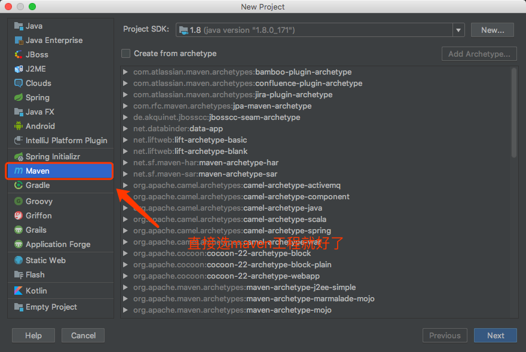
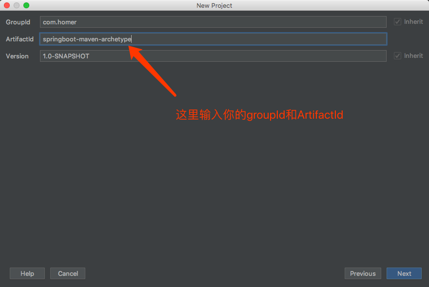
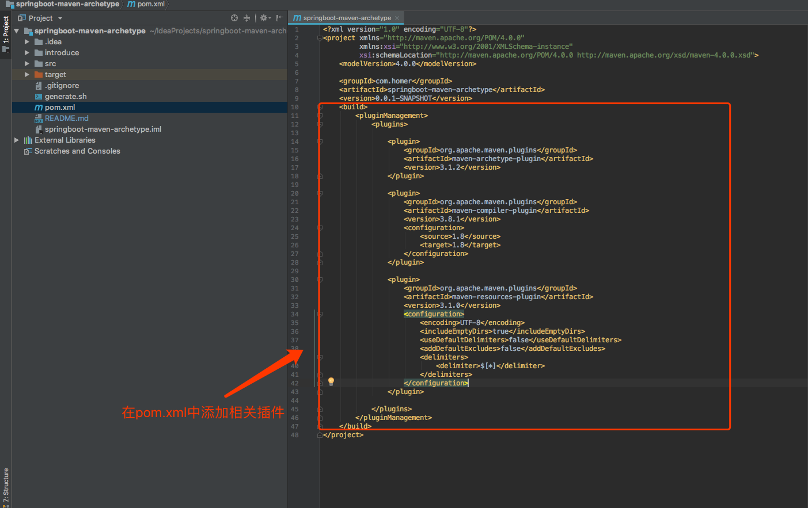
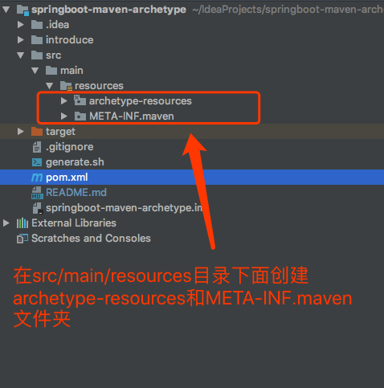
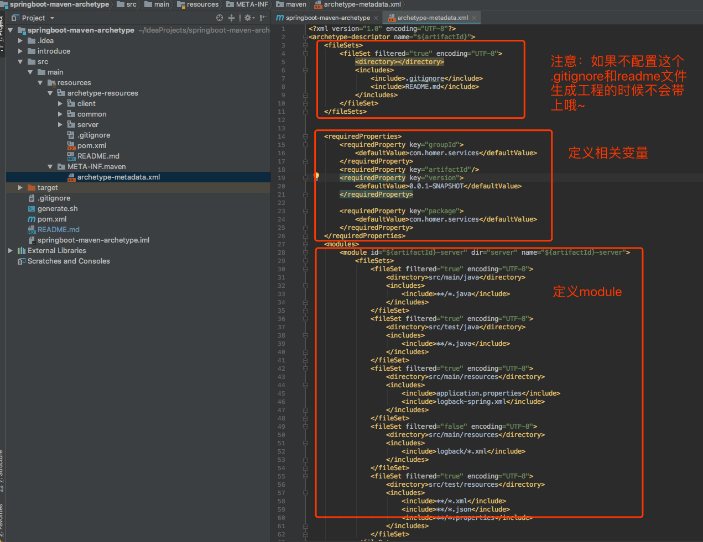
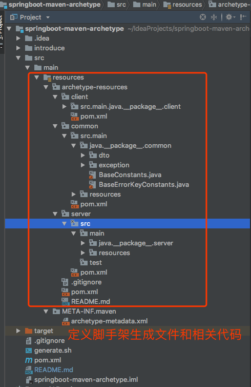

手把手教你撸一个SpringBoot-maven-archetype脚手架
==============
> 小哥[源代码](https://github.com/DomoXian/springboot-maven-archtype)在这里，戳进来后，随手给个star或follower哦，我会互粉~~~
## 前言
大半夜码砖着实有点困，扛不住了，第一版先这些功能吧~
- [x] 多module(目前分了server、common、client三个module)
- [x] 规范异常处理，全局异常处理和(ControllerAdvice实现)
- [x] 统一日志格式，植入全局链路traceId，方便根据日志定位问题
- [x] swagger管理接口文档
- [x] 接入actuator和prometheus,对相关应用指标进行埋点

## 一、创建和开发
#### 第一步
创建一个maven工程项目


#### 第二步
在工程里面的pom.xml中添加相关插件和依赖

#### 第三步
定义项目工程和结构




#### 第四步
编写脚手架代码，具体可以结合[代码](https://github.com/DomoXian/springboot-maven-archtype)看一下哈，这里就不过多叙述

## 二、编译和使用
#### 编译
如果你有maven仓库私服，可以在pom.xml文件中配置你的maven仓库地址：
```text
<!-- 仓库地址 -->
<distributionManagement>
    <repository>
        <id>private-releases</id>
        <name>Internal Releases</name>
        <url>这里填你仓库的地址/repository/maven-releases</url>
    </repository>
    <snapshotRepository>
        <id>private-snapshots</id>
        <name>Internal Snapshots</name>
        <url>这里填你仓库的地址/repository/maven-snapshots/</url>
        <uniqueVersion>false</uniqueVersion>
    </snapshotRepository>
</distributionManagement>
```
相关命令：
> mvn clean package
> mvn deploy

如果没有maven仓库私服，可以在把代码下载到本地然后，直接进行install到本地仓库中，相关命令：
> mvn clean install

#### 使用
mvn archetype:generate \
-DgroupId=输入你的groupId \
-DartifactId=输入你artifactId \
-Dpackage=输入你应用代码的包名 \
-Dversion=0.0.1-SNAPSHOT \
-DarchetypeGroupId=com.homer \
-DarchetypeArtifactId=homer-maven-archetype \
-DarchetypeVersion=0.0.1-SNAPSHOT

## 相关问题
mvn命令提示找不到。。。
> 额，是因为maven没有安装好，或者环境变量没有配置成功，自行百度解决maven安装和环境变量配置问题

.gitignore和README.md文件没有生成
> archetype-metadata.xml配置的姿势不对，请看下图，第一个fileSet应该将.gitignore和README.md手动include进去
 
